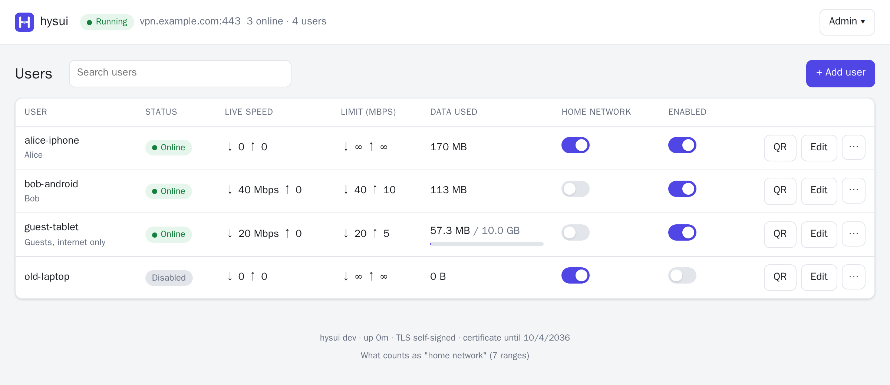

# hysui

A [Hysteria 2](https://v2.hysteria.network/) VPN server with a web panel for managing users, built on Hysteria's own server library. One small container, no database.



## Features

- **User management**: add, edit, disable and delete users. Each user gets a `hysteria2://` link and QR code that Hiddify, Karing, v2rayNG, Shadowrocket, NekoBox and the official client can import.
- **Per-user speed limits**: separate download and upload limits in Mbps. They cover all of a user's devices together and apply to live connections as soon as you save.
- **Per-user home-network access**: decide for each user whether they may reach devices on your LAN (router, NAS, printer…) or only the internet. Revoking access also cuts connections that are already open.
- **Data quotas**: optional upload+download allowance per user, with a usage bar and a reset button.
- **Live view**: who is online, how many devices, current speed and total traffic.
- **Disconnect**: kick a user's devices (they reconnect on their own unless you disable the user).
- **Certificates**: Let's Encrypt (HTTP or TLS challenge), your own certificate files (reloaded when they change) or self-signed with pinning.
- **Masquerade**: unauthenticated probes see a normal website (any URL you choose) instead of a VPN.
- **Import**: take over users from an existing Hysteria server config, so phones keep working without rescanning.

## Quick start (Docker Compose)

Requirements: a Linux host with Docker, a domain name pointing at it, and **UDP port 443** forwarded to it if it sits behind a router.

```bash
git clone https://github.com/revocx35/hysui.git
cd hysui
cp .env.example .env
nano .env                  # set HYSUI_DOMAIN at least
docker compose up -d
docker compose logs        # shows the generated panel password on first start
```

Open `http://<server-ip>:8080`, sign in, add a user and scan the QR code with a client app.

The compose file pulls `ghcr.io/revocx35/hysui:latest` (amd64 and arm64). To build from source instead, run `docker compose up -d --build`.

It uses host networking. That way the VPN sees real client addresses, can reach your LAN and IPv6, and Let's Encrypt's port-80 check works.

### Without Docker

```bash
go build -o hysui ./cmd/hysui
sudo HYSUI_DOMAIN=vpn.example.com HYSUI_DATA_DIR=/var/lib/hysui ./hysui
```

## Configuration

Everything is set with environment variables (see [.env.example](.env.example)):

| Variable | Default | Meaning |
|---|---|---|
| `HYSUI_DOMAIN` | *(required)* | Public hostname clients connect to. Used for the certificate and in client links. |
| `HYSUI_LISTEN` | `:443` | UDP address of the VPN. |
| `HYSUI_PUBLIC_PORT` | listen port | Port written into client links, if your router maps a different outside port. |
| `HYSUI_WEB_LISTEN` | `:8080` | Address of the panel (plain HTTP). |
| `HYSUI_ADMIN_USER` / `HYSUI_ADMIN_PASSWORD` | `admin` / random | Panel login created on first start. A random password is printed to the log. |
| `HYSUI_TLS_MODE` | `acme-http` | `acme-http`, `acme-tls`, `file` or `self-signed`. |
| `HYSUI_ACME_EMAIL` | | Optional contact address for the CA. |
| `HYSUI_ACME_CA` | `letsencrypt` | `letsencrypt`, `letsencrypt-staging` or an ACME directory URL. |
| `HYSUI_ACME_ALT_PORT` | 80 / 443 | Local port for the ACME check, if something forwards it to another port. |
| `HYSUI_TLS_CERT` / `HYSUI_TLS_KEY` | | PEM files for `file` mode. |
| `HYSUI_MASQUERADE_URL` | | Website to show to probes, e.g. `https://news.ycombinator.com/`. Empty = 404. |
| `HYSUI_HOME_EXTRA` | | Extra CIDRs to treat as "home network", comma-separated. |
| `HYSUI_DETECT_LOCAL` | `true` | Treat the server's own addresses and IPv6 /64s as home network. |
| `HYSUI_TRUSTED_PROXIES` | | Reverse proxies in front of the panel (CIDRs, or `private`). |
| `HYSUI_SECURE_COOKIES` | `auto` | `auto` marks the session cookie Secure when the panel is reached over HTTPS. |
| `HYSUI_DATA_DIR` | `/data` | Users, panel login and certificates. |
| `HYSUI_LOG_LEVEL` | `info` | `debug`, `info`, `warn` or `error`. |

### What counts as "home network"

- Private and link-local ranges: `10/8`, `172.16/12`, `192.168/16`, `169.254/16`, `100.64/10`, `fc00::/7` and `fe80::/10`.
- Every address of the server itself.
- The **/64 of each public IPv6 address** on the server. Home routers usually hand out a public IPv6 prefix, so private-range rules alone would let "internet only" users reach LAN devices over IPv6. The prefix is re-detected every 5 minutes, because ISPs change it.

Loopback is blocked for everyone, so VPN users can't reach services bound to the server's `localhost`. The panel lists the active ranges at the bottom of the page.

### Let's Encrypt when port 80 belongs to a reverse proxy

`acme-http` needs Let's Encrypt to reach `http://<domain>/.well-known/acme-challenge/…` on this server. If a reverse proxy such as Nginx Proxy Manager owns port 80, set it up like this:

1. Add a proxy host for the domain that forwards to `http://<this-server>:80`. Or set `HYSUI_ACME_ALT_PORT=8081` and forward to that port instead.
2. Leave its SSL setting at **none**. A proxy host with its own Let's Encrypt certificate answers the challenge itself, and renewals here fail.

The VPN traffic itself is UDP and never touches the proxy.

### Panel behind HTTPS

The panel speaks plain HTTP, so keep it on your LAN or put it behind a reverse proxy with HTTPS.

When proxied, set `HYSUI_TRUSTED_PROXIES` to the proxy's address. Login throttling then sees real client IPs, and cookies become `Secure`.

## Moving from a standalone Hysteria server

hysui uses the same `user:password` login format as Hysteria's `userpass` auth, and the same certificate storage as its built-in ACME. You can move over without touching the clients:

```bash
docker compose run --rm hysui import-hysteria -home /data/hysteria-config.yaml   # -home = allow home network
cp -r /var/lib/hysteria/acme/. ./data/acme/                                       # reuse the certificate
sudo systemctl disable --now hysteria-server
docker compose up -d
```

(Copy the old `config.yaml` into `./data/` first, so the container can read it.)

## Maintenance

```bash
docker compose stop && docker compose run --rm hysui reset-admin && docker compose start   # new panel password
docker compose pull && docker compose up -d                                                 # update
```

Back up the `data/` directory. It holds users, usage counters, the panel login and certificates.

## How it works

hysui links Hysteria's `core/server` package directly. Hysteria has no per-user policies, so hysui implements them through the hooks the core already exposes:

- **Speed limits**: the core reports every chunk it relays to the `TrafficLogger` *before* forwarding it. hysui waits there on a per-user token bucket (`golang.org/x/time/rate`), which throttles that user across all their connections. Returning `false` from the same hook disconnects a user, which is how quotas, disabling and kicking work.
- **Home-network access**: the core does not tell the outbound dialer which user a connection belongs to. It does, however, announce the user (`EventLogger.TCPRequest` / `UDPRequest`) on the same goroutine immediately before calling the outbound. hysui records the user per goroutine at that moment and picks it up in the dialer.
  - It resolves hostnames itself and checks every resolved address, and every UDP packet, against the user's policy.
  - If the pairing ever fails, for example after a core change, the dialer **fails closed**: no home-network access.
  - The test suite runs concurrent users with different policies to catch mix-ups.

The core version is pinned in `go.mod`. Upgrades are verified by the integration tests, which start a real server and connect with Hysteria's client library.

## Security notes

- The panel login uses bcrypt. Failed logins are throttled per IP (after 5 failures) and per account (after 20). Sessions are random tokens in `HttpOnly`, `SameSite=Strict` cookies.
- State-changing API calls require a custom header plus a same-origin check. The panel sends a strict Content-Security-Policy.
- VPN passwords are stored in plain text in `data/hysui.json`, because the panel must be able to show client links. The file is created with mode 0600.

## Development

```bash
go test -race ./...      # unit + integration tests (starts real Hysteria servers on localhost)
go run ./cmd/hysui       # with HYSUI_DOMAIN=localhost HYSUI_TLS_MODE=self-signed HYSUI_DATA_DIR=./data
```

## License

MIT. Hysteria is MIT-licensed by its authors.
